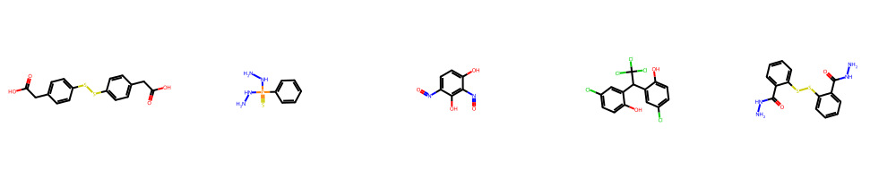
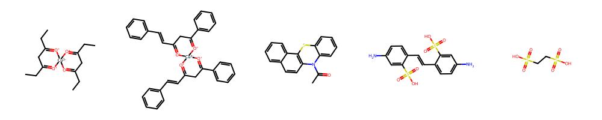
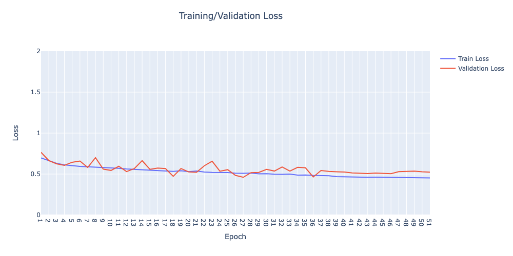

# HIV Molecule Classification Project

## Dataset

This project utilizes an HIV dataset released in May 2004, which categorizes chemical compounds into three classes based on the results of a screening test:

	•	CA: Confirmed Active
	•	CM: Confirmed Moderately Active
	•	CI: Confirmed Inactive

Class Simplification

For the purposes of this investigation, I merged classes CA and CM into a single positive class (assigned label 1), while the CI class is treated as the negative class (assigned label 0). This simplifies the classification problem into a binary task: identifying HIV-active vs. HIV-inactive molecules.

Here are some example of the HIV positive molecules:

Here are some example of the HIV negative molecules:

**Imbalanced Dataset Challenge**

One key challenge with this dataset is the imbalance between HIV-positive and HIV-negative samples:

	•	HIV positive molecules: 1,443
	•	HIV negative molecules: 39,684

To address the dataset imbalance, I employed a combination of undersampling HIV-negative molecules and oversampling HIV-positive molecules to achieve a more balanced training set. Additionally, I introduced a weighted loss function during training to penalize the misclassification of HIV-positive molecules, assigning a higher weight to their errors.

**Model**

I employed a Message Passing Neural Network (MPNN) for this classification task. MPNNs are designed for processing graph-structured data, which is well-suited for representing molecules as graphs with atoms as nodes and bonds as edges. For more information on MPNNs, please visit my blog: www.mathstoml.com.

**Model Performance**

The model’s performance on the test dataset is as follows:

	•	Test Loss: 0.4025
	•	Test Accuracy: 85.80%
	•	Recall: 41.58%
	•	Precision: 10.84%
	•	F1 Score: 17.20%

Despite a decent overall accuracy, the model struggled to correctly identify HIV-positive molecules, with 60% of HIV-positive samples being misclassified as inactive. This indicates a challenge in detecting the minority class (HIV positive) effectively, which is a common issue when dealing with imbalanced datasets.

I've attached a snapshot of the training loss below.

